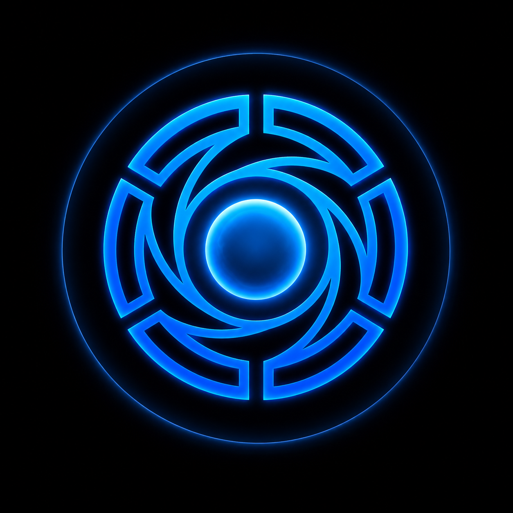

<div align="center">



# ⚡ HEIMDALL V5

### An evolving AI-powered assistant built to understand, reason, respond, and grow.

<br/>

> **"The goal was never to build just another chatbot."**

<br/>


<br/>

**HEIMDALL is an AI-powered assistant project focused on building a more structured, capable, and evolving intelligent system.**

[Explore V5](#-heimdall-v5) •
[Features](#-core-capabilities) •
[Architecture](#-architecture) •
[Installation](#-getting-started) •
[Roadmap](#-roadmap)

</div>

---

# 🌌 HEIMDALL V5

## An AI Assistant That Is More Than Just a Chat Interface

HEIMDALL V5 is the fifth major evolution of my AI assistant project.

The project started with a simple idea:

> **What if an AI assistant was designed as an actual system instead of just a prompt connected to an API?**

That question gradually turned into multiple experiments, architectures, rewrites, failures, improvements, and new ideas.

HEIMDALL V5 is the result of that journey so far.

It separates the application into a dedicated **frontend** and **backend**, while the backend itself is organized into multiple independent components responsible for different parts of the system.

Instead of putting everything inside one large script, HEIMDALL V5 explores a modular architecture involving:

- 🧠 AI processing
- 🎯 Intent detection
- 💬 Conversation handling
- 🧩 Context management
- 🧠 Memory systems
- 🔀 AI routing
- 🤖 Model providers
- 🔎 Search capabilities
- 🎙️ Voice integration
- 💻 Command handling
- 👤 Profile management
- ⚙️ System monitoring
- 🛠️ Development utilities

The project is still evolving, and not every visible feature represents a completed production-ready capability.

Some parts are fully functional.

Some are experimental.

Some are architecture prepared for future development.

And some are simply ideas waiting for their moment.

That is exactly what HEIMDALL is supposed to be:

### **An evolving system.**

---

# ✨ Core Capabilities

## 💬 Intelligent Conversations

At its core, HEIMDALL processes user input and routes it through its AI system to generate intelligent responses.

The conversation architecture is designed around multiple stages instead of directly sending every input to a model.

A simplified flow looks like this:

```text
User
  │
  ▼
Input Processing
  │
  ▼
Intent Detection
  │
  ▼
Context Analysis
  │
  ▼
AI Router
  │
  ▼
AI Provider
  │
  ▼
Response Controller
  │
  ▼
Final Response
